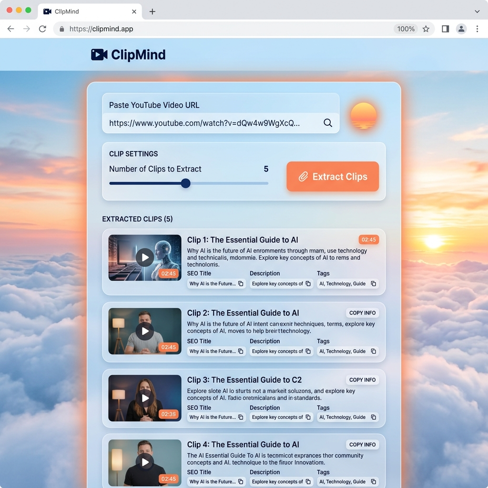
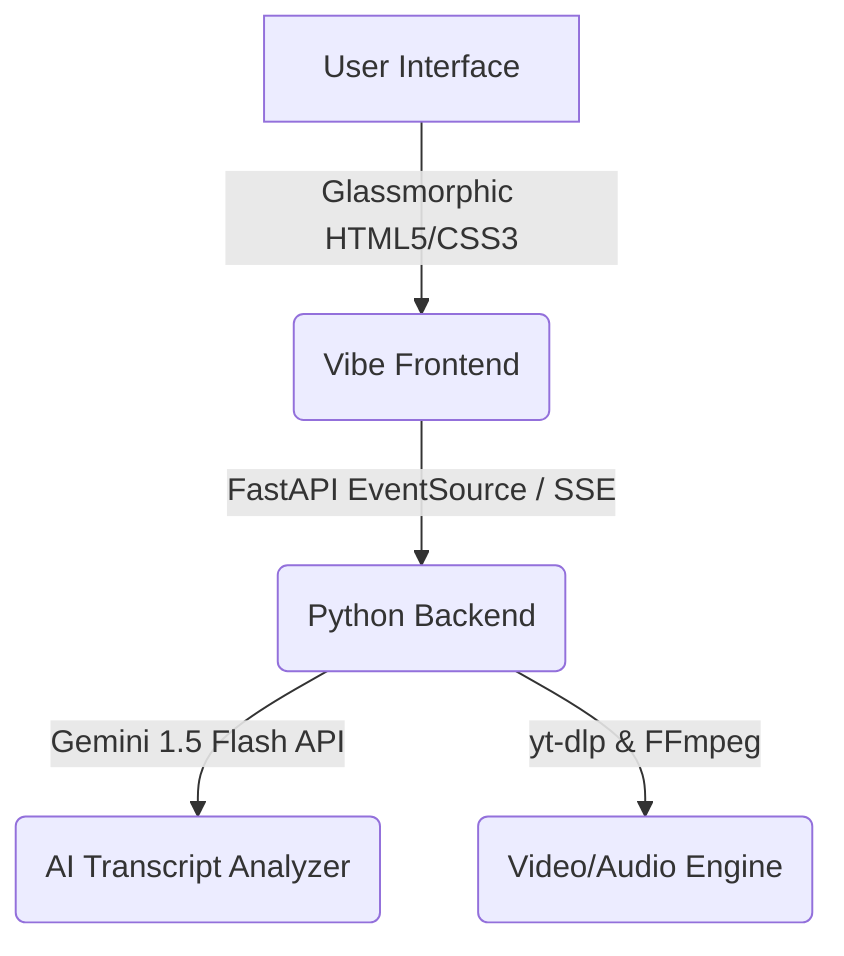

# 🌌 AntiGravity: The Vibe Coding Odyssey

Welcome to **AntiGravity** — a centralized repository of cutting-edge applications, utilities, and experiments created entirely through the power of **Vibe Coding**. 

Designed and orchestrated by **Anil Babu Samineni**, this repository showcases how human creativity, design aesthetics, and advanced AI agent collaboration (**Antigravity AI**) can co-create production-ready applications at breakneck speed.

---

## 🛸 What is Vibe Coding?

**Vibe Coding** represents a paradigm shift in software development:
* **The Developer** acts as the high-level architect, UI/UX designer, and systems coordinator, defining the product vision, design language, and behavior.
* **The AI Agent** handles the boilerplate, unit testing, performance optimization, refactoring, and execution steps, working directly within the codebase.
* **The Symphony**: By "vibing" together, they build complex systems rapidly, iterating in real-time on visual styles, API structures, and features.

---

## 🚀 Showcased Projects

Here is the flagship project featured in this repository:

| Project | Type | Description | Link |
| :--- | :--- | :--- | :--- |
| **ClipMind** 🧠 | AI Video Highlight Extractor | A modern web application that takes a YouTube video link, analyzes its transcripts using **Gemini 1.5 Flash**, and automatically extracts engaging highlight clips (under 60s) perfect for YouTube Shorts. | [View Project](./clipmind) |

### 🧠 ClipMind Highlight Preview
Below is a preview of the **ClipMind** interface, featuring a custom sky-blue, floating cloud, and sunset-orange glassmorphism design:



---

## 🛠️ The AntiGravity Tech Stack

The projects in this repository utilize a curated selection of modern, high-performance technologies:



* **Frontend**: Vanilla HTML5, Custom HSL Tailwind-free CSS, and Modern Vanilla JS (SSE / Server-Sent Events).
* **Backend**: FastAPI (Python), Uvicorn.
* **Video Processing**: FFmpeg (with input seeking and keyframe GOP optimization) & OpenCV.
* **AI & LLM Orchestration**: Google Generative AI (Gemini 1.5 Flash).

---

## 💻 Setup & Running Projects

Each project lives in its own subdirectory and contains a self-configuring environment setup.

To launch the flagship **ClipMind** project:
1. Ensure you have **Python 3.8+** and **FFmpeg** installed.
2. Navigate into the `clipmind` directory:
   ```cmd
   cd clipmind
   ```
3. Run the automated setup and startup script:
   ```cmd
   start_all.bat
   ```
4. Open your browser and launch `frontend/index.html` (e.g. via double-clicking or local server).

---

## 🎨 Design Philosophy
Every application in this repository conforms to strict aesthetic principles:
1. **Rich Aesthetics**: Custom gradients, soft shadows, and deep frosted-glass blur filters.
2. **Interactive Motion**: Micro-interactions, slide animations, and floating background blobs.
3. **No Generic Colors**: Specially curated color palettes (such as sunset oranges, sky blues, and cloud whites) rather than default browser colors.
4. **Developer Focused**: Built to be fast, responsive, and fun to use.

---

<div align="center">

**Created with 💖 by [Anil Babu Samineni](https://github.com/AnilSami)**  
*Powered by Vibe Coding & the Antigravity Agent*

</div>
