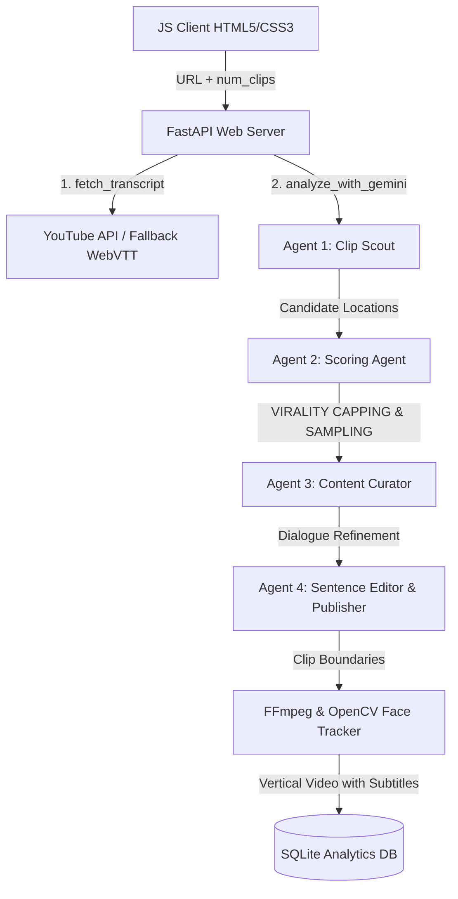

# 🧠 ClipMind v1.0 — AI Video Highlight Extractor

Welcome to **ClipMind v1.0** — a production-grade, containerized AI video curation pipeline that automatically extracts high-engagement vertical highlight clips (under 60s) from long-form YouTube videos, complete with face-tracking auto-cropping and stylized kinetic subtitles.

Designed and orchestrated entirely through the power of **Vibe Coding** by **Anil Babu Samineni** and the Antigravity AI agent.

---

## 📸 Interface Preview
ClipMind features a custom sky-blue, floating cloud, and sunset-orange glassmorphism design:


---

## 🛸 Key Features

- **Decoupled 4-Agent Pipeline**: Scout chunking, Scoring, Curator Deduplication, and Sentence Editor boundary refinement.
- **89% Cost Optimization (Credit Saver Mode)**: Candidate sampling and pre-refinement capping restrict expensive parallel LLM calls to the absolute minimum.
- **Face-Tracking (Camera QA)**: Autonomously crops 16:9 landscape video into 9:16 vertical using OpenCV face detection.
- **NVENC GPU Acceleration**: Automatic fallback between high-performance hardware encoders and software encoders (`libx264`).
- **Kinetic Subtitle Styles**: Auto-generates stylized ASS subtitles with customizable presets (classic, karaoke, kinetic).

---

## 🛠️ Tech Stack & Flow



---

## 📖 Project Documentation

Browse our comprehensive guides:
1. **[Installation Guide](docs/installation_guide.md)**: Setup virtualenvs, databases, and system packages (FFmpeg).
2. **[Quick Start Guide](docs/quick_start_guide.md)**: Boot up the web server locally or via Docker.
3. **[Configuration Guide](docs/configuration_guide.md)**: Explains CORS, environment keys, and custom overlay keying.
4. **[Production Deployment Guide](docs/production_deployment_guide.md)**: Outlines cloud VM deployment, Nginx proxy, and volume persistence.
5. **[API Documentation](docs/api_documentation.md)**: View all exposed REST endpoints and SSE schemas.
6. **[Architecture Overview](docs/architecture_overview.md)**: Deep dive into the 4-Agent orchestration and video processing engine.
7. **[Troubleshooting Guide](docs/troubleshooting_guide.md)**: Common fixes for database lockups, API tokens, and FFmpeg pathing.
8. **[FAQ](docs/faq.md)**: Frequently asked questions about credit savings and performance.
9. **[Release Checklist](docs/release_checklist.md)**: v1.0.0 production deployment checklist.

---

## 💻 Quick Setup

Ensure you have **Python 3.10+** and **FFmpeg** installed.

### Local Development Startup
* **Windows**:
  Double-click `start_all.bat` or run:
  ```cmd
  start_all.bat
  ```
* **Linux / macOS**:
  Run:
  ```bash
  chmod +x start_all.sh
  ./start_all.sh
  ```

### Production Server Startup (Docker Compose)
* **Linux / macOS**:
  Run:
  ```bash
  chmod +x start_production.sh
  ./start_production.sh
  ```
* **Windows**:
  Run:
  ```cmd
  start_production.bat
  ```

---

## 📁 Repository Folder Structure

```text
AntiGravity/
├── assets/                     # Visual/Audio static resources
│   ├── animations/             # Custom animated Like button overlays (like_button.webm)
│   └── sfx/                    # Custom impact sound effects (like_click.mp3)
├── backend/                    # FastAPI python backend
│   ├── config.py               # Central environment settings manager
│   ├── main.py                 # FastAPI application routes
│   ├── clipper.py              # Subprocess piping, face-tracking, and OpenCV resizes
│   ├── overlays.py             # Like animations, splits, delays, and click audio mixes
│   └── requirements.txt        # Pinned production python packages
├── docs/                       # Markdown release and config guides
├── frontend/                   # UI client HTML5 dashboard
│   ├── index.html              # Custom sunset sunset-orange & sunset-blue glassmorphism page
│   └── index.css               # Core styling and typography utilities
├── Dockerfile                  # Production container packaging blueprint
└── docker-compose.yml          # Container compose volumes and health checks
```

---

<div align="center">

**Created with 💖 by [Anil Babu Samineni](https://github.com/AnilSami)**  
*Powered by Vibe Coding & the Antigravity Agent*

</div>
