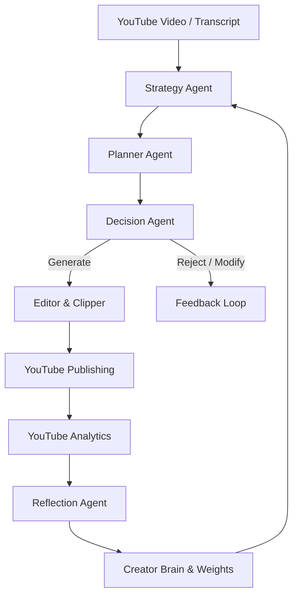

# Personal AI Content Strategist — Developer Documentation

Welcome to the **Personal AI Content Strategist** developer guide. This document explains the architecture, memory model, self-correction engine, autonomous agent pipeline, and evaluation framework designed to help the ClipMind application continually learn from creator preferences and YouTube analytics metrics.

---

## 🗺️ High-Level System Architecture

The Personal AI operates on top of the original ClipMind video curation pipeline, introducing a multi-agent feedback loop.

---

## 🧠 Core Modules

### 1. Creator Brain (`personal_ai/brain/`)
Stores the creator's profile, audience persona, long-term goals, styling preferences, and publishing calendar.
- **Service (`brain/service.py`)**: Interface for updating and fetching the creator profile. Automatically seeds sensible defaults if the database is uninitialized.
- **Schema (`models/schemas.py`)**: Strict Pydantic models enforcing schema validation for all parameters.

### 2. Multi-tiered Memory System (`personal_ai/memory/`)
Provides three levels of context retention:
- **Short-Term Memory (`memory/short_term.py`)**: Volatile, fast cache storing session states (active clip concepts, parameters, transcripts).
- **Long-Term Memory (`memory/long_term.py`)**: Persistent SQLite event logging.
- **Semantic Memory (`memory/semantic.py`)**: Implements local BM25 ranking to retrieve matching successful/failed patterns from historical transcripts.

### 3. Learning & Self-Correction Engine (`learning_engine.py`)
- Automatically adjusts virality scorer weights based on creator actions (approvals increase category weights, rejections decrease them).
- Performs Pearson correlation analysis against views and retention metrics to prioritize parameters that actually drive performance.

### 4. Autonomous Agents (`personal_ai/`)

#### Strategy Agent (`strategy/strategist.py`)
Analyzes transcripts to define dominant emotional tones, hook styles, target audiences, and viral opportunities matching Creator Brain preferences.

#### Planner Agent (`planning/planner.py`)
Formulates multiple candidate clip plans containing recommended titles, hooks, estimated virality, and visual/music styling.

#### Decision Agent (`decision/decider.py`)
Serves as the final quality filter. Decides whether to `generate`, `modify`, or `reject` the planner's recommendations using explainability criteria.

#### Reflection Agent (`reflection/reflector.py`)
Post-publish evaluations comparing predicted virality and retention scores against actual results from YouTube. Logs lessons learned and tunes weights.

---

## 📊 Evaluation & Benchmarking (`personal_ai/evaluation/`)

The evaluation framework compares the baseline ClipMind curation pipeline against the Personalized AI strategist pipeline using a seedable, reproducible historical dataset.

### Metrics Captured
1. **Precision & Recall**: Tracks the precision of decisions, counting False Approvals (generating a low-retention video) and False Rejections (skipping a high-retention video).
2. **Prediction Accuracy**: Measures Pearson correlation between predicted score and actual performance.
3. **Virality & Retention Calibration**: Evaluates MAE and RMSE prediction errors.

### Continuous Evaluation
Running the automated test suite (`test_evaluation.py`) generates three markdown reports in the artifacts directory:
- `accuracy_report.md`: Classification comparison metrics.
- `calibration_report.md`: Prediction error tracking.
- `improvement_report.md`: Overlapping lift summary showing mathematical improvements.
