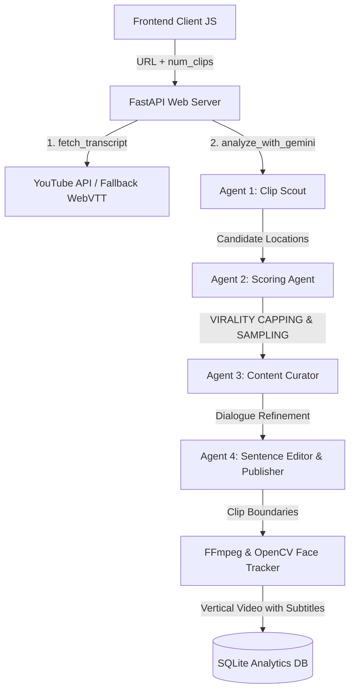

# Architecture Overview — ClipMind v1.0

ClipMind uses a highly decoupled, modular multi-agent architecture to orchestrate transcription, AI clip curation, face-tracking cropping, and NVENC GPU accelerated rendering.

---

## 🏗️ Systems Flow Diagram

---

## 🤖 The 4-Agent Curation Pipeline

1. **Agent 1: The Clip Scout**: Scans chunked transcript transcripts (~300 lines per chunk) in parallel to identify potential standalone highlight concepts.
2. **Agent 2: The Virality Scorer**: Scores candidate clips on **11 metrics** (including hook strength, emotional tension, contrarian viewpoint, and surprise). Rebalanced to prevent actionability from dominating the score.
3. **Agent 3: The Content Curator**: Filters overlapping candidate clips, performs semantic deduplication, and caps results to requested `num_clips` before refinement to save LLM tokens.
4. **Agent 4: The Sentence Editor & Viral Publisher**: Programmatically refines dialog boundaries, generates optimized Shorts titles, descriptions, and hashtags, and outputs the upload package.

---

## 🎥 Video Crop & Subtitle Engine

- **Boundary Snap (Silence Detection)**: Queries audio amplitude near crop boundaries using Librosa/FFmpeg to avoid snapping in the middle of words.
- **Camera QA (Face Tracking)**: Runs Haar Cascade face detection on crop windows. If speaker visibility falls under 70%, it falls back or skips the clip to ensure quality.
- **GPU Accelerated Rendering**: Automatically detects NVENC hardware support to run vertical 9:16 cropping, kinetic ASS subtitle burning, and audio amixing at up to 5x real-time speed.
